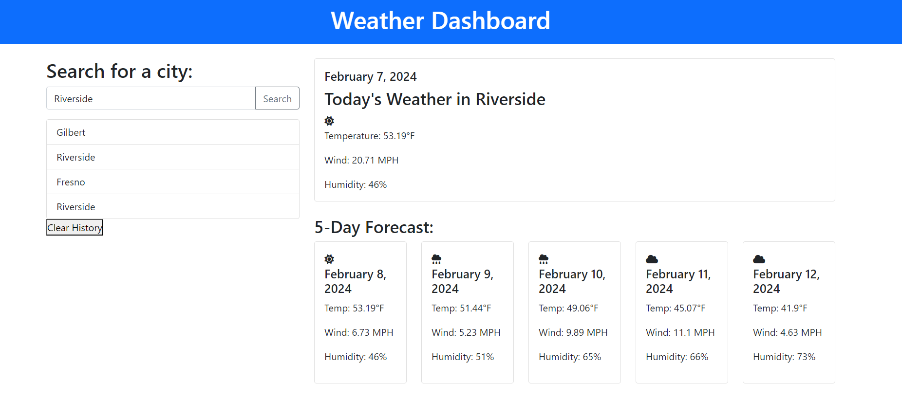

# Weather-Dashboard

## Description
This is a weather app that provides the current weather and the following five day forecast for a city based on search. It shows various measurements about the weather, and displays an icon dependent on the weather as well. Search history is saved to local storage and is displayed on screen, the user can also clear the history.

## Installation
Clone the code from the GitHub repo to install to your machine.

## Credits
Icons are used from Font Awesome

## Technologies Used
The code is written in JavaScript and HTML. Styling is Bootstrap and jQuery. Font icons are Font Awesome. Day JS was used as well for dates.

## Project Status and Future Plans
There are improvements that can be made, i would like to click on recent searches and be taken to that city. Adding an hourly forecast for the current day. For now, the project meets requirements

GitHub Repo: https://github.com/NicoleBrubaker/Weather-Dashboard

Live Site: https://nicolebrubaker.github.io/Weather-Dashboard/

